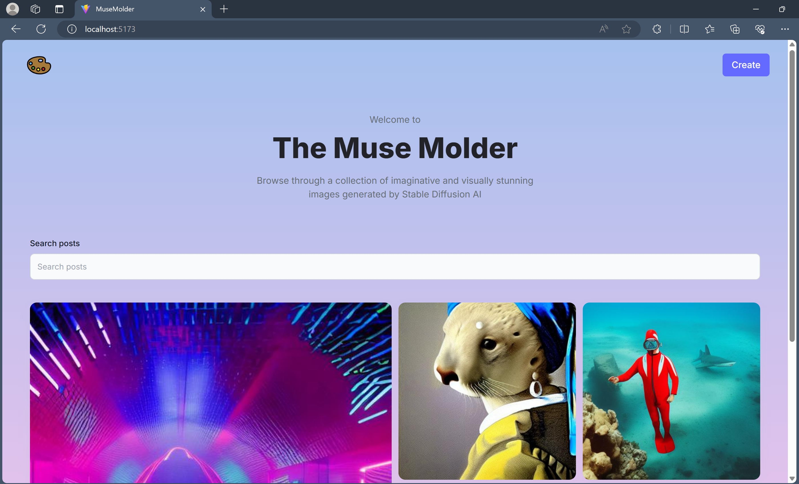
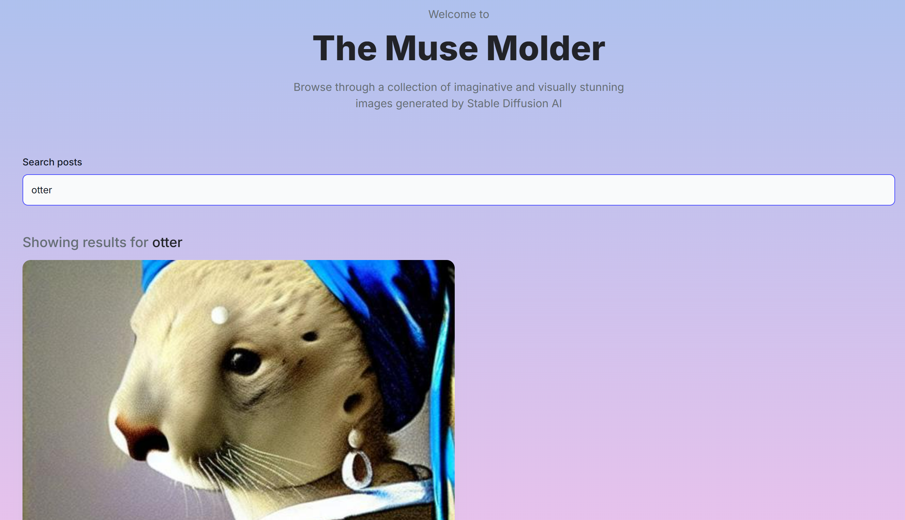
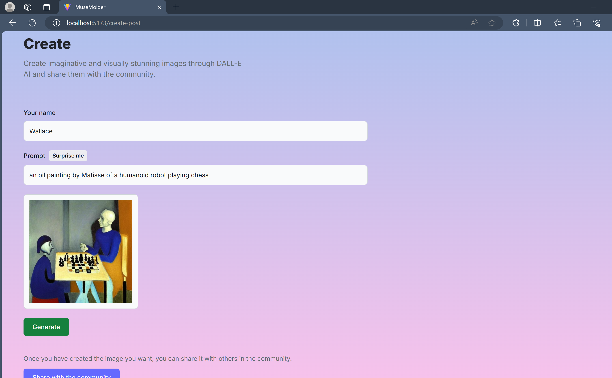

# OpenAIMernApp - MERN Application that integrates Stable Diffusion

This application was originally built as a basic AI image generating ful-stack app, but was modified to use FastAPI and Go backends for a faster response time. The application still has a React frontend, but implements CORS for security reasons. There is also a connection established with MongoDB to store the images created on Cloudinary by the users.

The application uses Tailwind CSS for a dynamic user interface. Visual Studio Code was the main text editor used.

### Frontend

The application deals with a React front base, hence it uses multiple folders like assets, components and pages to build the multi-page application.

Components will hold the code for reusable components while pages will hold the page layouts being shown on the app. There is another folder called constants defined that includes an index.js file with a list of prompts. These can be used to choose a random prompt in-case the user isn't sure about how to provide a text prompt to generate an image.

### Routing

In App.jsx, install 'react-router-dom' that will help implement routing from the main page. Use BrowserRouter to create Links and Routes to the Home page and create post page. Link allows to add links/routes to elements on the page, while Routes defines the routes available on the app.

I have installed the arrow function snippets extension that creates different specifications of arrow function. For example, afee creates an empty arrow function.
In index.css add a link to import specific font styles. 

## Backend

The backend consists of 2 sections: A FastAPI server and a Gin server

### FastAPI server

There are multiple websites on the internet that provide image generation services like OpenAI and ImageGen, but they have to be subscribed to which can be expensive for students. Luckily I was able to implement the stable diffusion model from Inference API provided by Hugging Face since I do not have a GPU. FastAPI is very seamless and easy to implement a robust backend within very less time.

The FastAPI section was also Dockerised to overcome storage restrictions and allow the app to be served on any machine.

### Go Backend

I have used Gin framework to implement the Golang backend. I faced major hurdles while trying to connect due to CORS restrictions but could overcome them with the help of CoPilot suggestions. This server connects to MongoDB on startup and uses it to store and retrieve newly created images.
